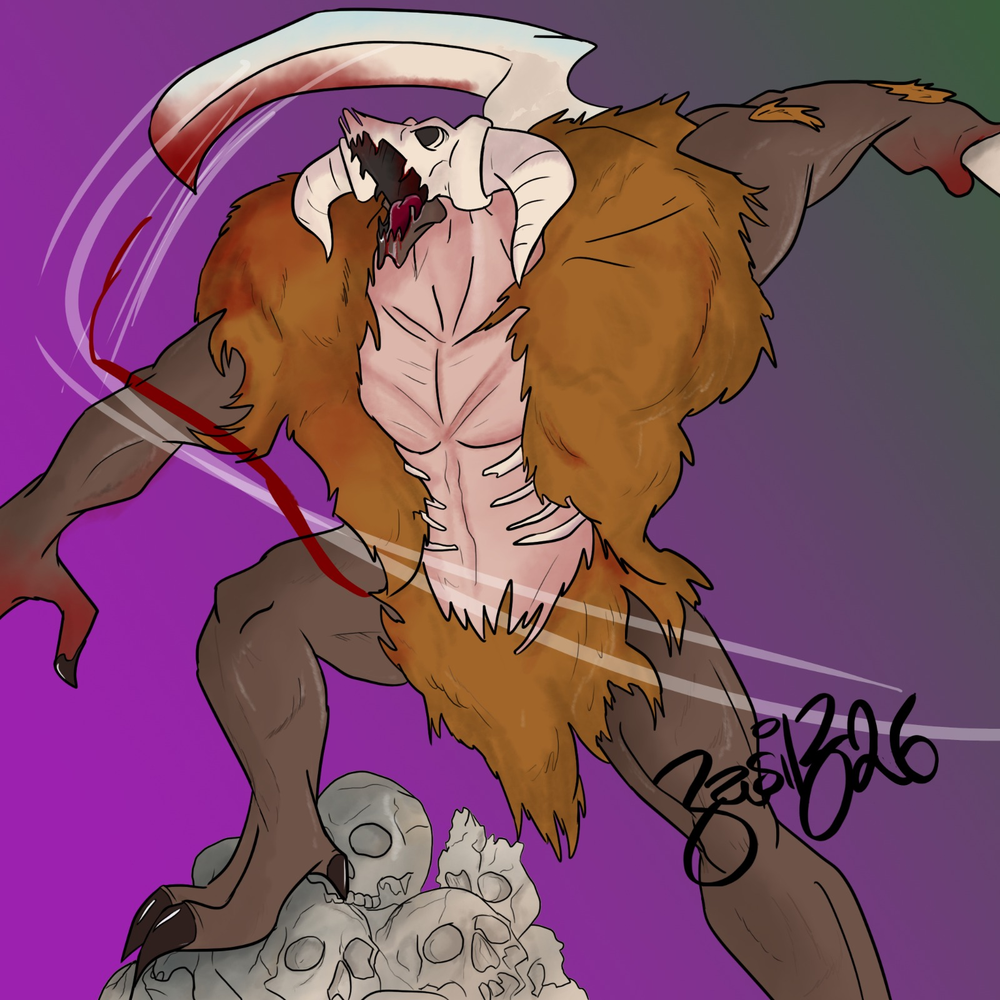

---
name: "Anghraboddh"
layer: "In-game"
type: "NPC"
tags: ["npc", "demon"]
aliases: ["Angraboddh", "Agraboddh", "General of Baphomet"]
source: "33on.txt + DM image"
---
General of [[Baphomet]], associated with the mask shard recovered earlier and confronted at the top of the [[Worldspire]]. He appeared as a huge deer-skull demon and forced the party through a two-stage battle: first wielding a huge bone scythe, then fighting with horns that became daggers. He dissolved when killed.

**First seen:** Session 29; **Last seen:** Session 43.
