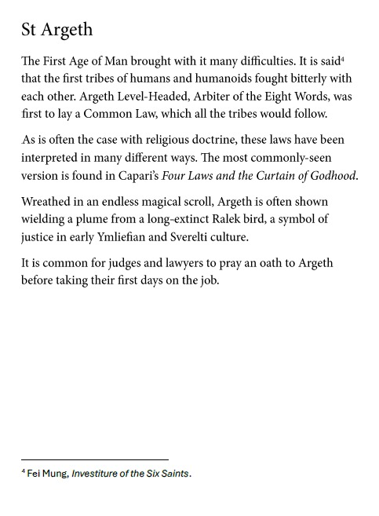

---
name: "Saint Argeth"
layer: "In-game"
type: "Lore"
tags: ["lore", "saint"]
aliases: ["Argeth Level-Headed", "Arbiter of the Eight Words"]
source: "DM saint image"
---
Saint associated with common law, arbitration and early justice. During the First Age of Man, Argeth was the first to establish a common law all tribes would follow.

He is often shown wrapped in an endless magical scroll and wielding a plume from a long-extinct Ralek bird, a symbol of justice in early Ymleifian and Sverelti culture. Judges and lawyers commonly pray an oath to Argeth before taking their first day on the job.

