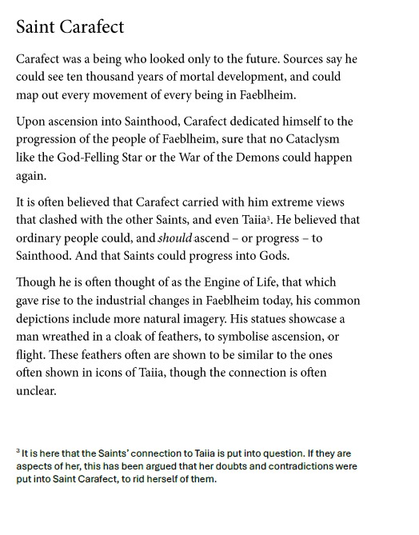

---
name: "Saint Carafect"
layer: "In-game"
type: "Lore"
tags: ["lore", "saint"]
aliases: ["St Carafect", "Cadafect", "Engine of Life"]
source: "33on.txt + DM saint image"
---
Saint of the future, progress and ascension. Carafect is said to have been able to see ten thousand years of mortal development and map the movement of every being in Faeblheim.

He dedicated himself to ensuring that no catastrophe like the God-Felling Star or Demon War could happen again. His views often clashed with the other Saints and even Taiia: he believed ordinary people could and should ascend to sainthood, and Saints could progress into gods.

Carafect is often depicted in a cloak of feathers, symbolising ascension or flight. The outer figure on the cracked altar beneath the palace maze was identified as Carafect.

**First seen:** Session 33; **Last seen:** Session 33.
