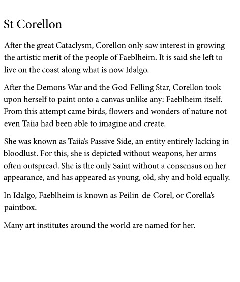

---
name: "Saint Corellon"
layer: "In-game"
type: "Lore"
tags: ["lore", "saint"]
aliases: ["St Corellon"]
source: "DM saint image"
---
Saint associated with art, natural wonder and Taiia's passive side. Corellon is said to have lived on the coast of what is now Idalgo, treating Faeblheim itself as a canvas after the Demon War and the God-Felling Star.

She is depicted without weapons, often with arms outspread. Her appearance varies widely between traditions, and Faeblheim is known in Idalgo as Peilin-de-Corel, or Corellon's paintbox.

