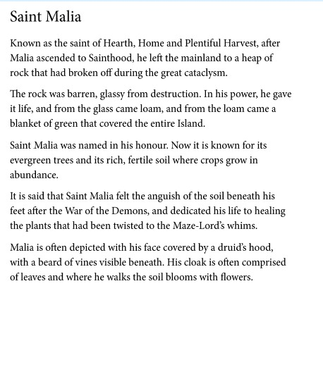

---
name: "Saint Malia"
layer: "In-game"
type: "Lore"
tags: ["lore", "saint"]
aliases: ["Malia"]
source: "DM saint image"
---
Saint of hearth, home and plentiful harvest. After ascension, Malia left the mainland for a barren, glassy rock broken off during the Great Cataclysm and restored it to green abundance. The island of [[St_Malia]] is named for him.

Malia is associated with healing land damaged by the Maze-Lord's influence. He is often shown hooded, bearded, and wrapped in a cloak of leaves, with flowers blooming where he walks.

