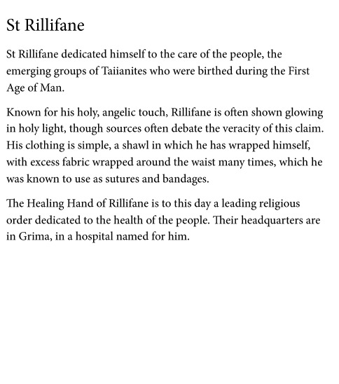

---
name: "Saint Rillifane"
layer: "In-game"
type: "Lore"
tags: ["lore", "saint"]
aliases: ["St Rillifane"]
source: "DM saint image"
---
Saint devoted to caring for the early Taiianites during the First Age of Man. He is known for a holy, angelic touch and is often shown glowing in holy light.

His simple clothing includes a shawl and excess fabric wrapped around his waist, said to be used as sutures and bandages. The Healing Hand of Rillifane remains a major religious order dedicated to healing, headquartered in a Grima hospital named for him.

