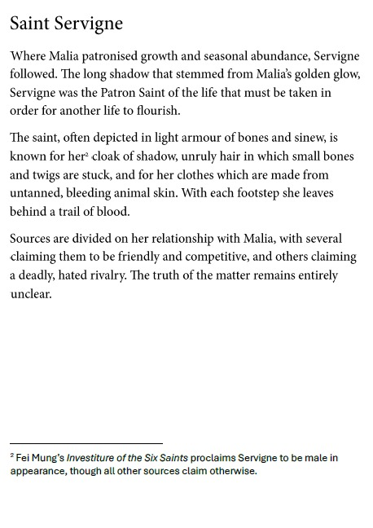

---
name: "Saint Servigne"
layer: "In-game"
type: "Lore"
tags: ["lore", "saint"]
aliases: ["Servigne"]
source: "DM saint image"
---
Saint who followed after [[Saint_Malia|Saint Malia]] and is patron of the life that must be taken so another life can flourish. Servigne is often depicted in light armour of bone and sinew, with a cloak of shadow, unruly bone-studded hair or twigs, and clothes made from untanned, bleeding animal skin.

Sources disagree on Servigne's relationship with Malia, variously describing friendship, rivalry or deadly hatred.

