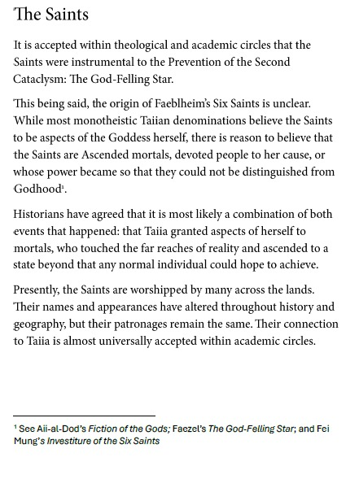

---
name: "Six Saints"
layer: "In-game"
type: "Lore"
tags: ["lore", "religion"]
aliases: ["The Saints", "Taiia's Six Saints"]
source: "33on.txt + DM saint images"
---
The Six Saints were instrumental in preventing the Second Cataclysm, also known as the [[God-Felling_Star|God-Felling Star]]. Their origin is disputed: some Taiian denominations treat them as aspects of [[Taiia]], while other scholars believe they were ascended mortals whose power became almost indistinguishable from godhood. The likeliest account may be a blend of both.

They are widely worshipped across Faeblheim. Their names and appearances vary by history, geography and religious tradition, but their patronages remain broadly stable, and their connection to Taiia is widely accepted in academic circles.

The party later discovered evidence that the Saints may also be connected to the [[Monarchs]]. A freed Saint stated that he was one of the Monarchs, and that [[Adonis_Blue_(Dagger)|Adonis Blue (Dagger)]] is one as well.

## Known Saints

- [[Saint_Malia|Saint Malia]]: hearth, home and plentiful harvest.
- [[Saint_Corellon|Saint Corellon]]: art, beauty and Taiia's passive side.
- [[Saint_Rillifane|Saint Rillifane]]: healing and care for the people.
- [[Saint_Argeth|Saint Argeth]]: common law, arbitration and justice.
- [[Saint_Servigne|Saint Servigne]]: life taken so other life can flourish.
- [[Saint_Carafect|Saint Carafect]]: progress, ascension and the future.

**First seen:** Session 33; **Last seen:** Session 43.
